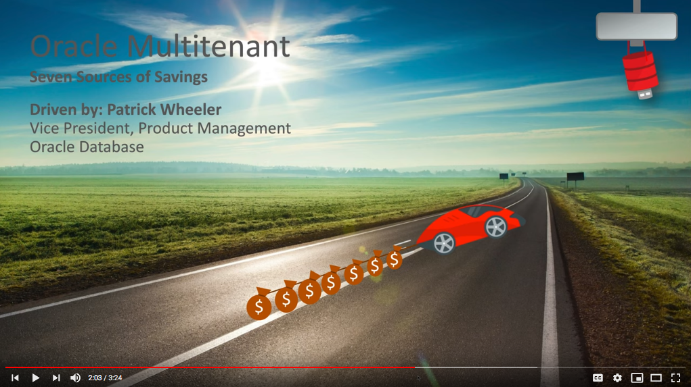

# Introduction

## Oracle Multitenant
From the point of view of an application, the pluggable database (PDB) is the database, in which applications run unchanged. PDBs can be very rapidly provisioned and a pluggable database is a portable database, which makes it very easy to move around, perhaps for load balancing or migration to the Cloud.

Many PDBs can be plugged into a single Multitenant Container Database (CDB). From the point of view of a Database Administrator (DBA), the CDB is the database. Common operations are performed at the level of the CDB enabling the DBA to manage many as one for operations such as upgrade, configuration of high availability, taking backups; but we retain granular control when appropriate. This ability to manage many as one enables tremendous gains in operational efficiency.

Enormous gains in technical efficiency are enabled by a shared technical infrastructure. There’s a single set of background processes and a single, global memory area – the SGA – shared by all the PDBs. The result is that with this architecture we can consolidate more applications per server.

*Estimated Workshop Time*: 4 hours

Watch the video below for an overview of Oracle Multitenant.

### Objectives

The objectives of this workshop is to understand the basic functionality of Oracle database multitenant features which would cover Cloning, Plug and Unplug PDBs, Hot Cloning, Refresh and Relocation. and in-depth understanding of advanced features like Application Containers

### Prerequisite

- Some understanding of cloud and database terms is helpful
- Familiarity with Oracle Cloud Infrastructure (OCI) is helpful

### Containers and Pluggable Databases

A CDB includes zero, one, or many customer-created pluggable databases (PDBs). A PDB is a portable collection of schemas, schema objects, and nonschema objects that appears to an Oracle Net client as a non-CDB. All Oracle databases before Oracle Database 12c were non-CDBs.

A container is either a PDB or the root. The root container is a collection of schemas, schema objects, and nonschema objects to which all PDBs belong.

Every CDB has the following containers:
- Exactly one root
- Exactly one seed PDB
- User-created PDBs

### Diagram of CDBs and PDBs

The following figure shows a CDB with four containers: the root, seed, and two PDBs. Each PDB has its own dedicated application. A different PDB administrator manages each PDB. A common user exists across a CDB with a single identity. In this example, common user SYS can manage the root and every PDB. At the physical level, this CDB has a database instance and database files, just as a non-CDB does.

You may now [proceed to the next lab](#next).

## Learn More

- Seven Sources of Savings for Companies with Multitenant

- Oracle Database Product Management Videos on Multitenant

## Acknowledgements

- **Authors/Contributors** - Patrick Wheeler, David Start, Vijay Balebail, Kay Malcolm
- **Contributors** -  Anoosha Pilli, Brian McGraw, Quintin Hill, Rene Fontcha
- **Last Updated By/Date** - Rene Fontcha, LiveLabs Platform Lead, NA Technology, April 2021
